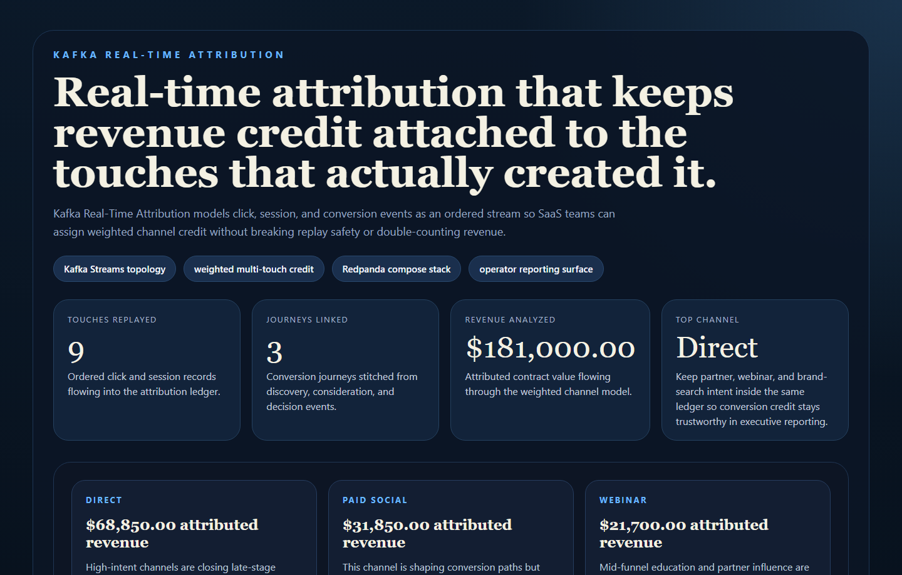
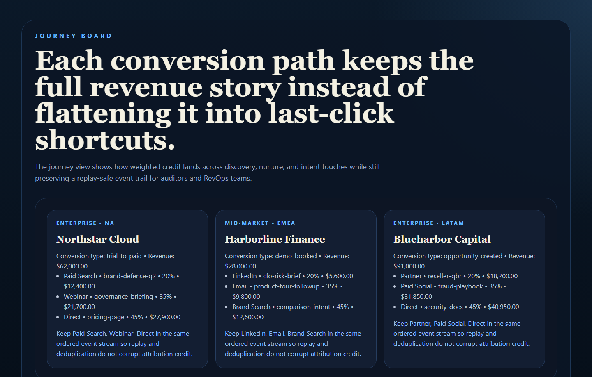
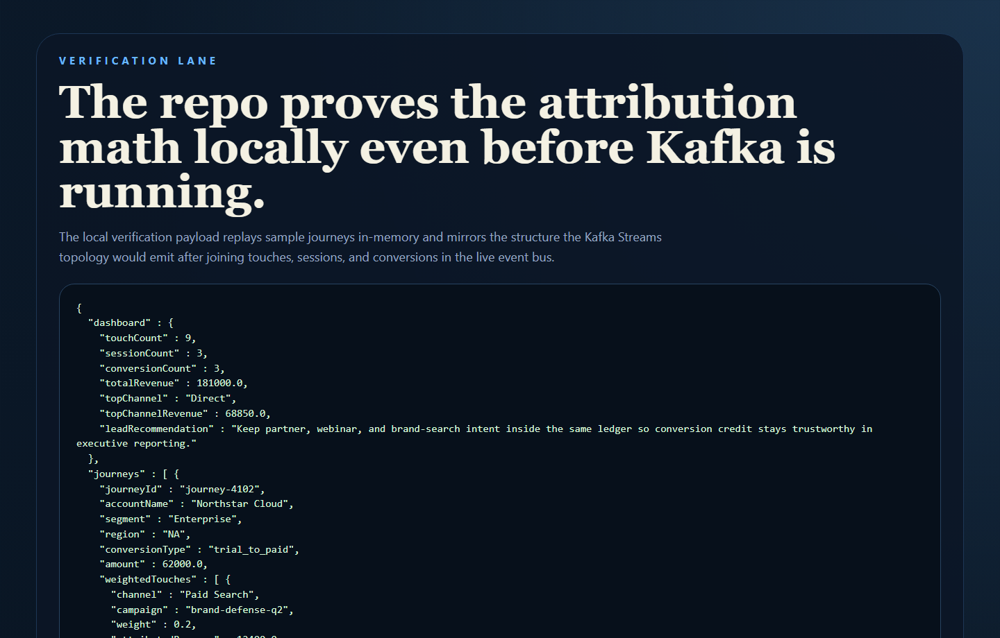
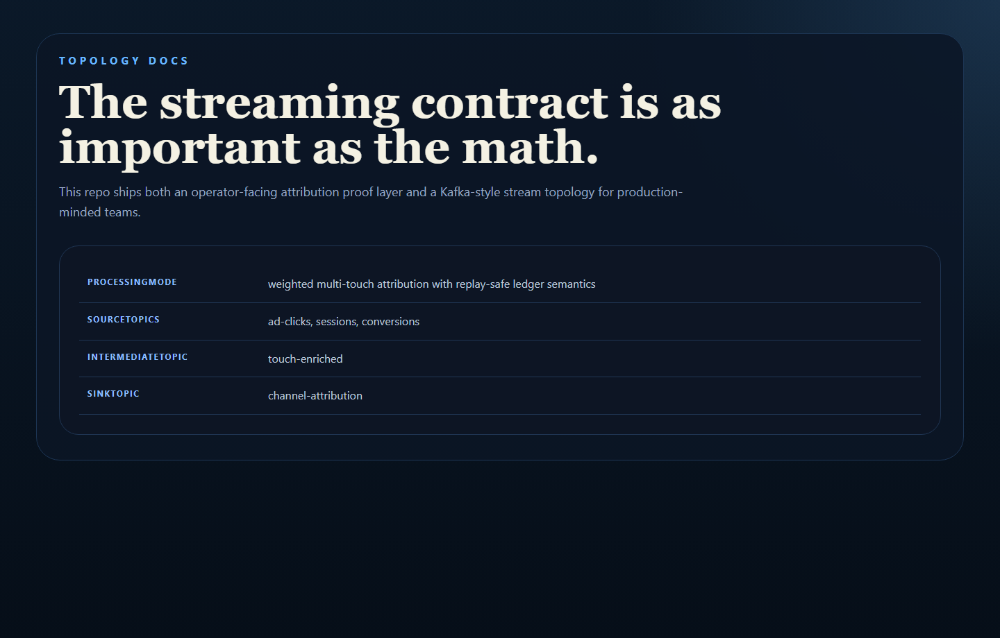

# Kafka Real-Time Attribution

Real-time multi-touch attribution for SaaS growth teams, built around Kafka-style
event streams so channel credit stays ordered, replayable, and commercially believable.

## Why This Repo Is Good

- It tackles a real analytics and RevOps problem instead of a toy streaming demo.
- It models click, session, and conversion events as a ledgered stream.
- It gives operators a way to explain channel credit without falling back to last-click shortcuts.
- It includes a Kafka Streams topology and a local no-Kafka demo mode, so the repo is useful immediately.

## What It Ships

- Spring Boot service with attribution APIs
- weighted multi-touch attribution engine
- Kafka Streams topology summary
- Redpanda `docker-compose` stack for local streaming infrastructure
- real PNG screenshots generated from repo-owned proof pages
- tests and CI

## Screenshots

### Overview



### Journey Board



### Verification



### Topology



## Local Run

```powershell
Set-Location "C:\Users\chaus\dev\repos\kafka-real-time-attribution"
$env:JAVA_HOME = "C:\Program Files\Microsoft\jdk-21.0.11.10-hotspot"
$env:Path = "$env:JAVA_HOME\bin;$env:Path"
.\mvnw.cmd spring-boot:run
```

Open:

- [http://127.0.0.1:4649/](http://127.0.0.1:4649/)
- [http://127.0.0.1:4649/journeys](http://127.0.0.1:4649/journeys)
- [http://127.0.0.1:4649/verification](http://127.0.0.1:4649/verification)
- [http://127.0.0.1:4649/docs](http://127.0.0.1:4649/docs)

If that port is occupied:

```powershell
$env:PORT = "4653"
.\mvnw.cmd spring-boot:run
```

## Optional Redpanda Stack

```powershell
docker compose up -d
```

This exposes:

- Kafka at `localhost:19092`
- Redpanda Console at [http://127.0.0.1:8088/](http://127.0.0.1:8088/)

## Validation

```powershell
Set-Location "C:\Users\chaus\dev\repos\kafka-real-time-attribution"
$env:JAVA_HOME = "C:\Program Files\Microsoft\jdk-21.0.11.10-hotspot"
$env:Path = "$env:JAVA_HOME\bin;$env:Path"
.\mvnw.cmd test
.\mvnw.cmd package
powershell -ExecutionPolicy Bypass -File .\scripts\render_readme_assets.ps1
```

## Example Routes

- `GET /api/dashboard/summary`
- `GET /api/events`
- `GET /api/journeys`
- `GET /api/channels`
- `GET /api/topology`
- `GET /api/sample`

## Repo Layout

- `src/main/java/com/mizcausevic/kafkarealtimeattribution/controllers`
- `src/main/java/com/mizcausevic/kafkarealtimeattribution/services/AttributionService.java`
- `src/main/java/com/mizcausevic/kafkarealtimeattribution/streams/KafkaTopologyFactory.java`
- `docker-compose.yml`
- `docs/architecture.md`

## Why It Matters

Marketing teams want real-time attribution. RevOps teams want believable credit.
Finance teams want numbers they can defend. Kafka-style ordering plus replay-safe
credit assignment is what makes those three needs compatible.
